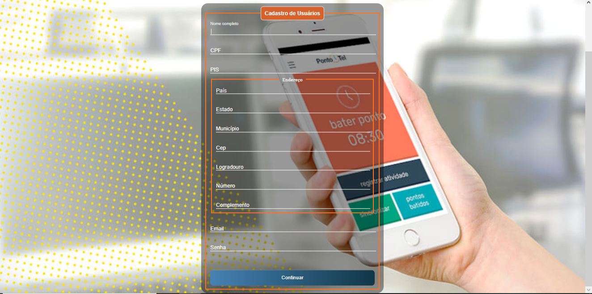
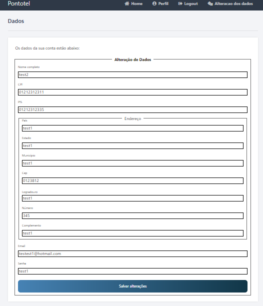

# Front-End-Estágio-Cadastro-WEB


Tabela de conteúdos
=================
<p align="center">
 <a href="#objetivo">Objetivo</a> • 
 <a href="#tecnologias">Tecnologias</a> • 
 <a href="#estrutura-dos-arquivos">Estrutura dos arquivos</a> • 
 <a href="#imagens-utilizadas-na-aplicação">Imagens utilizadas na aplicação</a> • 
 <a href="#imagens-da-aplicação">Imagens da aplicação</a> • 
 <a href="https://cadastrousuarioweb.herokuapp.com/login/">Heroku</a> •
 <a href="#considerações-finais">Considerações finais</a> •
 <a href="#autor">Autor</a> 

</p>

## Objetivo
<p>Essa aplicação consiste em um cadastro de usuário web onde se pode: cadastrar, logar, visualizar e alterar os dados da base cadastral.</p>

## Tecnologias 
##### • HTML  
##### • CSS3 
##### • PYTHON 
##### • FLASK 
##### • PHPMYADMIN
##### • FLASK_MYSQLDB
##### • WAMPSERVER

## Estrutura dos arquivos
A estrutura dos arquivos foi feita da seguinte forma:

```bash

└── front-end-estagio
│   ├──__pyache__
│   │   └── app.cpython-39.py       
│   │
│   ├──src/toreadme
│   │  ├── alteracaodedados.png
│   │  ├── cadastro.png
│   │  ├── home_page.png
│   │  ├── login.png
│   │  └── perfil.png
│   │
│   ├── static/css3
│   │   ├── estilos.css3 
│   │   ├── login.css3
│   │   ├── style.css3	 
│   │   ├── style1.jpg
│   │   └── style2.jpg
│   │   
│   │   
│   └── template
│       ├── alteracao.html
│       ├── cadastro.html
│       ├── home.html
│       ├── layout.html   
│       ├── login.html
│       └── profile.html         
│                 
├── Procfile
├── app.py
├── projeto.sql
├── requeriments.txt
└── README.md
```


## Imagens utilizadas na aplicação
<p align="center">
 
 
</p>
<h6> Todos os direitos de imagem são reservados à empresa Pontotel<h6>

## Imagens da aplicação
<p align="center">
 
 
 
 
 
 </p>
 
##  Considerações finais

<p> Gostaria de agradecer pela oportunidade de participar desse processo seletivo.</p>


## Autor

### Augusto Oliveira Costa


